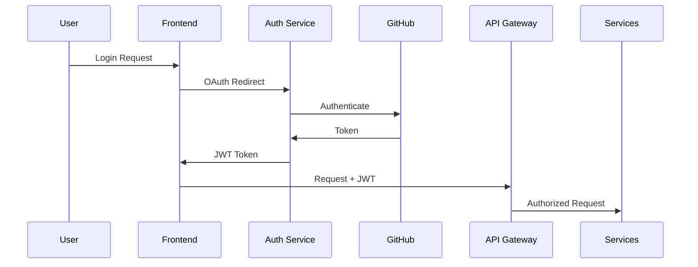

# CodeMentor AI - Technical Specifications

## System Architecture

### Microservices Design
```
┌─────────────────────────────────────────────────────────┐
│                     Load Balancer                        │
└─────────────┬───────────────────────────┬───────────────┘
              │                           │
    ┌─────────▼─────────┐       ┌────────▼────────┐
    │   Web Frontend    │       │  IDE Extensions  │
    │    (Next.js)      │       │  (VS Code, JB)   │
    └─────────┬─────────┘       └────────┬────────┘
              │                           │
    ┌─────────▼───────────────────────────▼────────┐
    │           GraphQL API Gateway                 │
    │              (Apollo Server)                  │
    └───┬───────┬───────┬───────┬───────┬─────────┘
        │       │       │       │       │
    ┌───▼──┐ ┌─▼──┐ ┌─▼──┐ ┌─▼──┐ ┌─▼───┐
    │ Auth │ │ AI │ │Code│ │Docs│ │Learn│
    │ Svc  │ │Svc │ │Svc │ │Svc │ │ Svc │
    └──────┘ └────┘ └────┘ └────┘ └─────┘
```

## API Specifications

### GraphQL Schema
```graphql
type Query {
  getCompletions(code: String!, language: Language!): [Completion!]!
  analyzeCode(repoUrl: String!): CodeAnalysis!
  detectBugs(fileContent: String!): [Bug!]!
  generateDocs(moduleId: ID!): Documentation!
  getUserProgress(userId: ID!): LearningProgress!
}

type Mutation {
  submitCode(input: CodeInput!): CodeResponse!
  fixBug(bugId: ID!, approach: FixApproach): Fix!
  trainModel(datasetId: ID!): TrainingJob!
  saveSnippet(snippet: SnippetInput!): Snippet!
}

type Subscription {
  codeCompletions(sessionId: ID!): Completion!
  reviewUpdates(prId: ID!): ReviewComment!
  learningHints(userId: ID!): Hint!
}
```

### REST Endpoints (Legacy Support)
- `POST /api/v1/complete` - Get code completions
- `POST /api/v1/analyze` - Analyze code quality
- `POST /api/v1/review` - Submit code for review
- `GET /api/v1/docs/:id` - Retrieve documentation
- `POST /api/v1/learn/assess` - Assess skill level

## Database Schemas

### PostgreSQL - Main Database
```sql
-- Users and Authentication
CREATE TABLE users (
    id UUID PRIMARY KEY DEFAULT gen_random_uuid(),
    email VARCHAR(255) UNIQUE NOT NULL,
    github_id VARCHAR(255) UNIQUE,
    created_at TIMESTAMPTZ DEFAULT NOW(),
    subscription_tier VARCHAR(50) DEFAULT 'free'
);

-- Projects and Repositories
CREATE TABLE projects (
    id UUID PRIMARY KEY DEFAULT gen_random_uuid(),
    user_id UUID REFERENCES users(id),
    repo_url VARCHAR(500),
    language VARCHAR(50),
    framework VARCHAR(50),
    last_analyzed TIMESTAMPTZ,
    settings JSONB
);

-- Code Snippets and Patterns
CREATE TABLE snippets (
    id UUID PRIMARY KEY DEFAULT gen_random_uuid(),
    user_id UUID REFERENCES users(id),
    title VARCHAR(255),
    code TEXT,
    language VARCHAR(50),
    tags TEXT[],
    usage_count INTEGER DEFAULT 0,
    created_at TIMESTAMPTZ DEFAULT NOW()
);

-- Learning Progress
CREATE TABLE learning_progress (
    id UUID PRIMARY KEY DEFAULT gen_random_uuid(),
    user_id UUID REFERENCES users(id),
    skill_level VARCHAR(50),
    languages JSONB,
    completed_lessons TEXT[],
    current_path VARCHAR(255),
    points INTEGER DEFAULT 0,
    updated_at TIMESTAMPTZ DEFAULT NOW()
);
```

### Vector Database - Weaviate Schema
```json
{
  "class": "CodeEmbedding",
  "properties": [
    {
      "name": "code",
      "dataType": ["text"]
    },
    {
      "name": "language",
      "dataType": ["string"]
    },
    {
      "name": "projectId",
      "dataType": ["string"]
    },
    {
      "name": "embedding",
      "dataType": ["number[]"]
    },
    {
      "name": "metadata",
      "dataType": ["object"]
    }
  ]
}
```

## AI Model Specifications

### Model Architecture
- **Base Model**: CodeLlama-34B for code generation
- **Fine-tuning**: LoRA adapters for each language
- **Embedding Model**: CodeBERT for semantic search
- **Classification**: XGBoost for bug severity prediction

### Training Pipeline
```python
class CodeMentorTrainingPipeline:
    def __init__(self):
        self.base_model = "codellama/CodeLlama-34b-hf"
        self.learning_rate = 2e-5
        self.batch_size = 32
        self.epochs = 3
        
    def prepare_dataset(self, repo_urls: List[str]):
        # Extract and process code from repositories
        pass
        
    def fine_tune(self, dataset):
        # Fine-tune with LoRA
        pass
        
    def evaluate(self, test_set):
        # Evaluate model performance
        pass
        
    def deploy(self, model_id: str):
        # Deploy to production
        pass
```

### Inference Optimization
- Model quantization (INT8) for faster inference
- Batch processing for multiple requests
- Caching frequent completions
- Edge deployment for IDE extensions
- Streaming responses for large generations

## Security Implementation

### Authentication Flow


### Encryption Standards
- **Data at Rest**: AES-256-GCM
- **Data in Transit**: TLS 1.3
- **Key Management**: AWS KMS / HashiCorp Vault
- **Token Security**: JWT with RSA-256
- **Secret Storage**: Environment variables + sealed secrets

## Deployment Configuration

### Kubernetes Manifests
```yaml
apiVersion: apps/v1
kind: Deployment
metadata:
  name: codementor-ai-service
spec:
  replicas: 3
  selector:
    matchLabels:
      app: ai-service
  template:
    metadata:
      labels:
        app: ai-service
    spec:
      containers:
      - name: ai-service
        image: codementor/ai-service:latest
        ports:
        - containerPort: 8000
        resources:
          requests:
            memory: "4Gi"
            cpu: "2"
            nvidia.com/gpu: 1
          limits:
            memory: "8Gi"
            cpu: "4"
            nvidia.com/gpu: 1
        env:
        - name: MODEL_PATH
          value: "/models/codellama-34b"
        - name: REDIS_URL
          valueFrom:
            secretKeyRef:
              name: redis-secret
              key: url
```

### CI/CD Pipeline
```yaml
name: Deploy CodeMentor AI

on:
  push:
    branches: [main]

jobs:
  test:
    runs-on: ubuntu-latest
    steps:
      - uses: actions/checkout@v3
      - name: Run tests
        run: |
          npm test
          python -m pytest
      
  build:
    needs: test
    runs-on: ubuntu-latest
    steps:
      - name: Build and push Docker images
        run: |
          docker build -t codementor/ai-service:${{ github.sha }} .
          docker push codementor/ai-service:${{ github.sha }}
  
  deploy:
    needs: build
    runs-on: ubuntu-latest
    steps:
      - name: Deploy to Kubernetes
        run: |
          kubectl set image deployment/ai-service ai-service=codementor/ai-service:${{ github.sha }}
          kubectl rollout status deployment/ai-service
```

## Performance Optimization

### Caching Strategy
- **Redis**: Session data, frequent completions
- **CDN**: Static assets, documentation
- **Browser Cache**: IDE extension resources
- **Model Cache**: Loaded models in memory
- **Query Cache**: GraphQL response caching

### Scaling Rules
- **Horizontal Scaling**: Based on CPU > 70%
- **Vertical Scaling**: GPU nodes for AI services
- **Auto-scaling**: 2-10 replicas per service
- **Load Balancing**: Round-robin with health checks
- **Circuit Breaker**: Hystrix for fault tolerance

## Monitoring & Observability

### Metrics Collection
- **Prometheus**: System and application metrics
- **Grafana**: Visualization dashboards
- **ELK Stack**: Log aggregation and search
- **Jaeger**: Distributed tracing
- **Sentry**: Error tracking and alerting

### Key Metrics
- API response time (p50, p95, p99)
- Model inference latency
- Code completion accuracy
- Bug detection precision/recall
- User engagement metrics
- System resource utilization

## Testing Strategy

### Test Coverage Requirements
- Unit tests: > 80% coverage
- Integration tests: All API endpoints
- E2E tests: Critical user workflows
- Performance tests: Load and stress testing
- Security tests: Penetration testing

### Test Automation
```javascript
describe('Code Completion API', () => {
  it('should return completions within 100ms', async () => {
    const start = Date.now();
    const response = await api.getCompletions({
      code: 'function fibonacci(',
      language: 'javascript'
    });
    
    expect(Date.now() - start).toBeLessThan(100);
    expect(response.completions).toHaveLength(5);
    expect(response.completions[0].confidence).toBeGreaterThan(0.8);
  });
});
```